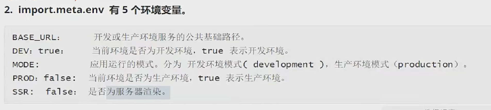
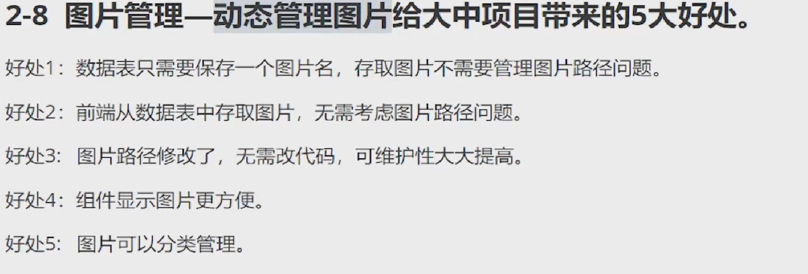

# Vue 3 + TypeScript + Vite

## 

## 自定义变量环境

1. .env.production 表示生产环境下的文件
2. .env.development 表示开发环境下的文件
3. .env 表示备选环境文件
   注意：vite 只处理以 VITE 开头的环境变量

## 安装 dotenv 配置 vite 默认环境代理等

```
import { defineConfig, CommonServerOptions } from "vite";
import vue from "@vitejs/plugin-vue";
import fs from "fs";
import dotenv, { DotenvParseOutput } from "dotenv";
export default defineConfig((mode) => {
const envFileName: string = ".env";
const curEnvFileName = `${envFileName}.${mode.mode}`; // 配置环境变量的文件
// 1.读取文件,获取不同环境下的配置文件
const envData = fs.readFileSync(curEnvFileName, "utf-8"); // 同步读取文件，获取的是 buffer 数据
const envMap: DotenvParseOutput = dotenv.parse(envData); // buffer 转换为对象形式
let server: CommonServerOptions = {}; // 配置服务开发
if (mode.mode === "development") {
server = {
host: envMap.VITE_HOST,
port: envMap.VITE_PORT,
proxy: {
// 代理可以解决跨域的问题
[envMap.VITE_BASE_URL]: {
target: envMap.VITE_PROXY_DOMAIN,
},
},
};
console.log("开发者模式环境");
} else if (mode.mode === "production") {
console.log("生产者模式环境");
server = {
host: envMap.VITE_HOST,
port: envMap.VITE_PORT,
};
}
return {
// base: "dxmk", // 项目基础根路径
plugins: [vue()],
server,
};
});
```

## 动态管理图片



## eslint 配置

yarn add eslint eslint-plugin-vue vue-eslint-parser @typescript-eslint/parser @typescript-eslint/eslint-plugin -D
