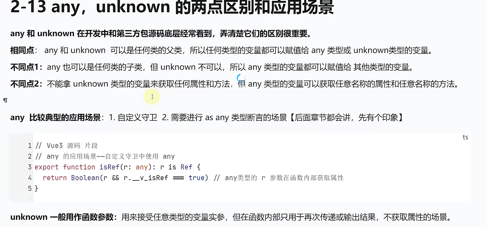

# typescript

**_javascript 语言的超集_**

## typescript 初始化

1. npm init -y
2. yarn add typescript -D
3. tsc --init

## typescript 编译

```
配置 tsconfig.json 文件的rootDir（要编译的ts文件）outDir(编译后的js文件存放的目录)
使用 tsc 编译文件
```

## typescript 常用类型

1. 基本类型 => **_number string boolean symbol null undefined _**
2. 根类型（Object , {}） => **_这两个类型是除了 undefined 和 null 之外都匹配的类型_**
3. 对象类型 => **_Array object function_**
4. 枚举类型 => **_enum _**
5. 特殊数据类型 => **_any unknown never void tuple_**
6. 合成类型 => **\*联合联系，交叉类型\***
7. 字面量数据类型 => **_ 值作为数据类型 _**

```
// 联合类型
let str: string | number = "abc";
str = 3;
console.log(str);
```

```
// 交叉类型
type Obj1 = { username: string };
type Obj2 = { age: number };
let obj1: Obj1 = { username: "111" };
let obj2: Obj2 = { age: 111 };
let obj3: Obj1 & Obj2 = { username: "111", age: 111 }; // 并集

```

## never 出现的场景和意义

```
type Data = string | number;
function fn(data: Data): void {
  if (typeof data == "string") {
    console.log("字符串类型", data.length);
  } else if (typeof data == "number") {
    console.log("数值类型", data.toFixed(2));
  } else {
    console.log(data); // 这里的data的类型是never，避免出现未来拓展新的类没有对应的类型
  }
}

fn("111");
fn(1.233);
```

## 枚举的分类

```
// 枚举分为 数字枚举和字符串枚举
// 数字枚举 => 只需要定义第一个变量的值，后面的值依次递增+1
enum Num {
  num1 = 1,
  num2, // 2
  num3, // 3
  num4, // 4
  num5,
  num6,
}

console.log(Num.num3); // 3
console.log(Num[4]); // num4  可以根据值取到属性

```

**_枚举的好处 _**

1. 有默认值和可以自增值
2. 语义更清楚，可读性更强
3. 即是数据类型又是值

## any 和 unknown 的区别



## 接口的作用

```
// 接口,定义对象类型的类型

// 特点1，可以继承,type 不可以继承

interface Pet {
  name: string;
  love: number;
}

interface Dog extends Pet {
  hobby: Array<string>;
}

// 特点2. 为多个类提供弄个统一的方法和属性声明

interface List {
  add(): void;
  remove(): void;
}

class ArrayList implements List {
  add(): void {
    throw new Error("Method not implemented.");
  }
  remove(): void {
    throw new Error("Method not implemented.");
  }
}

```

## 可索引签名

```
interface Protect {
  name: string;
  [x: string]: any; // string 并不是代表只能使用字符串作为属性
}
let p: Protect = {
  name: "name",
  age: 110,
  100: "ok",
};


// 索引访问类型
const symId = Symbol("product");
interface Product {
  [symId]: number; // 属性是一个变量
  name: string;
  price: number;
  buy(): string;
}

// 获取类型的属性
type A = Product["price"];
type B = Product["price" | "name"];
// 当我的属性是一个变量，获取属性应该怎么样获取，使用typeOF
type S = Product[typeof symId];

// 怎么获取interface定义类型的所有key
type Pkeys = keyof Product; // name| price| buy 并不会展示出我自己定义的变量symId
// 使用泛型
type AllKeys<T> = T extends any ? T : never;
type Pkeys2 = AllKeys<keyof Product>;


```

## interface 和 type 的区别

**_ type 和 接口类似 都用来定义类型 _**

1. 定义范围不同 。 interface 只能定义对象类型或者接口当名字的函数类型。type 可以定义任何数据类型
2. 接口可以继承一个或者多个接口，也可以继承 type,但是 type 没有
3. 接口可以合并声明，type 不可以

## const 关键字使用技巧

```
const arr = [10, 20, 30];
arr[0] = 100;
const arr1 = [10, 20, 30] as const;

arr1[0] = 100; // 无法为“0”赋值，因为它是只读属性。
```

## 元组

```
// 元祖是比较特殊的数组

//1.可变元组

let customer: [string, number, string, ...any[]] = ["xiaoming", 20, "pingpong"];
//2. 可变元组结构
let [cname, age, hobby, ...rest]: [string, number, string, ...any[]] = [
  "xiaoming",
  20,
  "pingpong",
  "213123",
  123123,
  Symbol(),
];
// 3.可变元组 tag

```

## class 类

```
class People {
  name: string; // 需要赋值不然会有错误
  age: number;
  addr: string;
  hobby!: Array<any>; // 不用使用初始值
  static count: number = 0; //静态属性，这个是属于类本身的，是公共的属性不是每个对象独有的
  constructor(_name: string, _age: number, _addr: string) {
    this.name = _name;
    this.age = _age;
    this.addr = _addr;
    People.count++; //记录人数的数量
  }
  say() {}
}

let p1 = new People("p1", 11, "222");
let p2 = new People("p2", 11, "222");
let p3 = new People("p3", 11, "222");

console.log(People.count); // 3

```

### 何时使用静态成员

```
// 静态方法
class DateUtl {
  static fn1() {}
  static fn2() {}
  static fn3() {}
}

DateUtl.fn1();
DateUtl.fn2();

```

## 单例模式的两种实现

```
// class DateUtl {
//   static fn1() {}
//   static fn2() {}
//   static fn3() {}
// }

// DateUtl.fn1();
// DateUtl.fn2();

// class DateUtl {
//   constructor() {
//     console.log("创建对象...");
//   }
//   fn1() {}
//   fn2() {}
//   fn3() {}
// }
// console.log("first");
// let d1 = new DateUtl();
// let d2 = new DateUtl();
/**
 * 打印顺序
 * 1.first
  2.创建对象...
  3.创建对象...
 *
*/

// 第一种：立即执行单例模式
class DateUtl {
  static dateUtl = new DateUtl();
  private constructor() {
    console.log("创建对象...");
  }
  fn1() {
    console.log("fn1");
  }
  fn2() {}
  fn3() {}
}
console.log("first");
// let d2 = new DateUtl(); // 类“DateUtl”的构造函数是私有的，仅可在类声明中访问。
let d1 = DateUtl.dateUtl;
let d2 = DateUtl.dateUtl;
console.log(d1 === d2); // true 只会创建一个实例，并且是在class创建的时候就实现
DateUtl.dateUtl.fn1();
/**
 *  执行顺序
 * 1.创建对象...
  2.first
  3.true
  4.fn1
 *
*/
```

```
/***
 * 第二种方式
 *  这样创建单例模式的好处是，你可以随时在需要类的时候去初始化
 *
 */
class DateUtl {
  static dateUtl: DateUtl;
  private constructor() {
    console.log("创建对象...");
  }
  static getInstance() {
    if (this.dateUtl) return;
    this.dateUtl = new DateUtl();
  }
  fn1() {
    console.log("fn1");
  }
  fn2() {}
  fn3() {}
}
console.log("first");
// let d2 = new DateUtl(); // 类“DateUtl”的构造函数是私有的，仅可在类声明中访问。
let d1 = DateUtl.dateUtl;
let d2 = DateUtl.dateUtl;
DateUtl.getInstance(); // 这样才会初始化类
DateUtl.getInstance();
DateUtl.getInstance();
DateUtl.getInstance();

console.log(d1 === d2); // true 只会创建一个实例

```

## class 中 getter 和 setter 方法的作用

**_对属性进行保护设置一些限制等操作_**

```
class People {
  name: string; // 需要赋值不然会有错误
  age: number;
  addr: string;
  hobby!: Array<any>; // 不用使用初始值
  static count: number = 0; //静态属性，这个是属于类本身的，是公共的属性不是每个对象独有的
  money!: number;
  constructor(_name: string, _age: number, _addr: string) {
    this.name = _name;
    this.age = _age;
    this.addr = _addr;
    People.count++; //记录人数的数量
  }
  set _money(val: number) {
    if (val > 100) throw new Error("数量不能大于100");
    this.money = val;
  }
  get _money() {
    return this.money + 10; // 所有的money数量都会+10
  }
  say() {}
}

// 获取money
new People("xiewen", 11, "sss")._money = 120;

```

## tsconfig.json 核心配置文件
